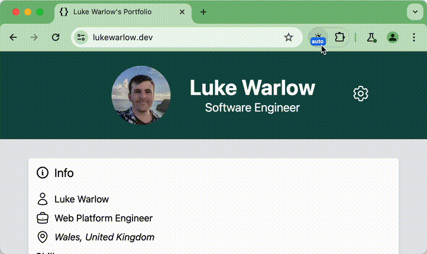

# Chrome Dark Mode Toggle

_Built by Bramus! – https://www.bram.us/_

## Real control over Light Mode / Dark Mode on a per-site basis!

This extension allows you to override the value of `prefers-color-scheme` globally in Chrome, and also on a per-origin basis. That way, if a site uses `prefers-color-scheme` in their stylesheet, you can keep your OS in Light Mode while watching a site in Dark Mode (or vice versa).

The override gets stored in the extension’s storage and gets synced to your Chrome profile so the next time you open the tab, the preference will be reapplied.

Because the extension is powered by the [Web Preferences API](https://wicg.github.io/web-preferences-api/), this also means that sites can change the preference through that API, which in turn gets picked up by the extension.

## Demo

Here’s a quick teaser as demonstrated on [Luke Warlow’s website](https://lukewarlow.dev/), thriving force behind the [Web Preferences API](https://wicg.github.io/web-preferences-api/):

A more extended demo is available to watch [on YouTube](https://www.youtube.com/watch?v=oaN39_M4zk4)

## Installation

You can [get the extension from the Chrome Web Store](https://chromewebstore.google.com/detail/chrome-dark-mode-toggle/idnbggfpadjhjicgjmhlpeilafaplnhd).

If you like this extension, please leave a review on the Chrome Web Store. I’d appreciate it.

## FAQ

- [General](#general)
    - [Why did you build this?](#why-did-you-build-this)
    - [How does this extension differ from other Dark Mode extensions?](#how-does-this-extension-differ-from-other-dark-mode-extensions)
- [Usage](#usage)
    - [What do I need to run this extension?](#what-do-i-need-to-run-this-extension)
    - [How do I change the mode of a site?](#how-do-i-change-the-mode-of-a-site)
    - [How can I place the extension’s icon next to Chrome’s Omnibox (URL bar)](#how-can-i-place-the-extensions-icon-next-to-chromes-omnibox-url-bar)
    - [Where can I see all overrides I have set?](#where-can-i-see-all-overrides-i-have-set)
    - [I see a light/dark glitch on load. Is this normal?](#i-see-a-lightdark-glitch-on-load-is-this-normal)
- [I don’t like the extension cycling through all values, I just want to toggle. Can I do that?](#i-dont-like-the-extension-cycling-through-all-values-i-just-want-to-toggle-can-i-do-that)
- [Troubleshooting](#troubleshooting)
    - [Why does this extension show a red “N/A” label on its icon?](#why-does-this-extension-show-a-red-na-label-on-its-icon)
    - [Why doesn’t the website I’m on change to a chosen mode?](#why-doesnt-the-website-im-on-change-to-a-chosen-mode)
    - [Why doesn’t the website I’m on change to a chosen mode even when it offers a dark mode?](#why-doesnt-the-website-im-on-change-to-a-chosen-mode-even-when-it-offers-a-dark-mode)
    - [Why doesn’t the website I’m on change to a chosen mode even when it offers a dark mode using `prefers-colo-scheme`?](#why-doesnt-the-website-im-on-change-to-a-chosen-mode-even-when-it-offers-a-dark-mode-using-prefers-colo-scheme)
- [Privacy](#privacy)
    - [What permissions does this extension have and why?](#what-permissions-does-this-extension-have-and-why)
    - [What happens with my data?](#what-happens-with-my-data)

### General

#### Why did you build this?

I think that Dark Mode Toggle Buttons should be a browser feature, something I have detailed in 2022 [in this article on my website](https://brm.us/dark-mode-override). Sometimes you want to read a website in Light Mode while your OS is in Dark Mode (or vice versa).

Thanks to the [Web Preferences API](https://wicg.github.io/web-preferences-api/) I was able to create this POC extension to see how this “Browser Dark Mode Toggle” button _could_ work in Chrome, [as detailed here](https://www.bram.us/2024/04/13/what-if-you-had-real-control-over-light-mode-dark-mode-on-a-per-site-basis/).

#### How does this extension differ from other Dark Mode extensions?

Other Dark Mode extensions for Chrome exist. Instead of tapping into the tools and features Web Authors can use to design a Dark Theme for a website (that is: `prefers-color-scheme`), these extensions often manipulate the site’s storage/cookies to opt-in to the chosen mode, inject custom stylesheets carefully constructed per site, or even resort to injecting a filter that inverts all colors on the page. Because of how those extensions work, they need to add support for each an every site individually and also need updating when the site’s approach to Dark Mode changes.

In contrast, this extension works with any site, as long as the site implements Dark Mode through `prefers-color-scheme` – [as it should be](https://www.bram.us/2019/12/10/how-to-add-dark-mode-to-a-javascript-app-react-angular-vue-etc/).

### Usage

#### What do I need to run this extension?

This extension uses the [Web Preferences API](https://wicg.github.io/web-preferences-api/), an API that is currently only available in Chrome 125+ behind a flag.

To enable the Web Preferences API, either:

- Launch Chrome with `--enable-features=WebPreferences`
- Enable the “Experimental Web Platform Features” flag through `chrome://flags`

Note that although the latter approach is easier, it enables more experimental features than just the Web Preferences API.

When the Web Preferences API is not enabled, the extension shows a red N/A label on top of its icon.

#### How do I change the mode of a site?

When visiting a site, click on the extension’s icon to change the mode for that origin. Click it again to change the value again.

By default the extension operates in “Cycle Mode” and cycles through all values (System, Forced Dark, Forced Light). The operation mode can be changed in the extension’s preferences.

#### How can I place the extension’s icon next to Chrome’s Omnibox (URL bar)

Click on the extensions icon (a puzzle piece) and find “Chrome Dark Mode Toggle“ in the list. Hit the pin icon to pin the extension.

#### Where can I see all overrides I have set?

Right click the “Chrome Dark Mode Toggle” extension icon and choose “Options” to open the options page. Under “Site-Specific color-scheme Preferences” you can see all origins that you have set an override for.

Use the dropdown to change the preference for that origin. Use the delete button to remove the entry.

### I don’t like the extension cycling through all values, I just want to toggle. Can I do that?

Yes. Go to the extension‘s options (right click the icon and choose options) and scroll to the bottom of the page. There you can change the mode from “Cycle” to “Toggle”.

When set to “Toggle”, the extension will switch between the System preferred color scheme and its opposite. For example, if your OS is set to Light Mode, the extension will toggle from System (Inherit) to Dark and then back to System.

#### I see a light/dark glitch on load. Is this normal?

Because of how this extension works – by executing scripts on sites – the answer unfortunately here is “yes”.

Note that this is not representative for how this feature would work if it ever gets built into a browser itself. If that ever became a reality, the browser would not need the Web Preferences API to override the value as it has other, more direct, ways of doing that.

### Troubleshooting

#### Why does this extension show a red “N/A” label on its icon?

This extension uses the [Web Preferences API](https://wicg.github.io/web-preferences-api/), an API that is currently only available in Chrome 125+ with the Experimental Web Platform Features flag enabled.

#### Why doesn’t the website I’m on change to a chosen mode?

Some websites – including [my own](https://bram.us) – don’t offer Dark Mode. Therefore, setting your OS or the override to Forced Dark has no effect on the website’s appearance.

#### Why doesn’t the website I’m on change to a chosen mode even when it offers a dark mode?

Some websites have implemented Dark Mode through a custom toggle that overrides the mode through flag on the `:root` element – typically a className or a data-attribute that gets set.

In that case, setting your OS or the override to Forced Dark has no effect on the website’s appearance, as it doesn’t respond to that.

A pity, as [responding to `prefers-colo-scheme` is how one should build Dark Mode into a website](https://www.bram.us/2019/12/10/how-to-add-dark-mode-to-a-javascript-app-react-angular-vue-etc/) …

#### Why doesn’t the website I’m on change to a chosen mode even when it offers a dark mode using `prefers-colo-scheme`?

Sometimes, the connection from the extension to the Chrome tab gets lost. In that case, close the tab and open a new one with that site.

### Privacy

#### What permissions does this extension have and why?

To work properly, this extension has the following [permissions](https://developer.chrome.com/docs/extensions/develop/concepts/declare-permissions):

- activeTab: Update the extension icon on a per-tab basis
- tabs: Synchronize the override from the options to open tabs
- scripting: Determine whether a site is in Dark or Light Mode
- storage: Persist your overrides

The extension is set to run on any `http://` or `https://` origin. The extension is self-contained and does not execute or load remote code.

#### What happens with my data?

Nothing. The overrides are persisted into the extension’s storage, which gets saved into your Chrome Profile. This data does not get sent to me nor any other service for analysis or the like. Everything stays in your profile.

## Reporting problems / Filing feature requests

Please [file an issue](https://github.com/bramus/chrome-dark-mode-toggle/issues) if you want to report a problem or make a feature request. When reporting a problem, please add a link to a URL where I can reproduce the problem.

## License

This extension is closed source for the time being. This might change over time.